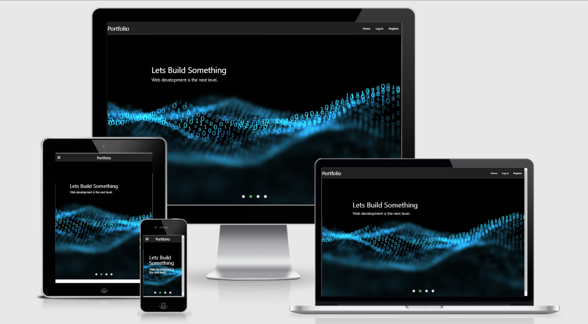
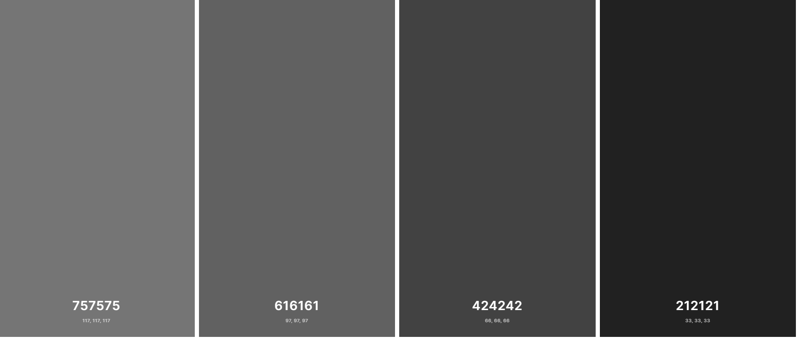

## **Goal for this project**

This project is all about my Portfolio, so in general am talking about my self and the skills I can render to the user or Customer.

In this portfolio you will be able to navigate with custom tuggle button through down the page and you will be able to scroll the page from the header to the footer.


## Table of Contents
* [UX](#ux)
    * [User Goals](#user-goals)
    * [User Stories](#user-stories)
    * [Site Owners Goals](#site-owners-goals)
    * [User Requirements and Expectations](#user-requirements-and-expectations)
        * [Requirements](#requirements)
        * [Expectations](#expectations)
    * [Design Choices](#design-choices)
        * [Fonts](#fonts)
        * [Colors](#colors)
        * [Structure](#structure)
* [Wireframes:](#wireframes)
    * [Wireframes](#wireframes)
    * [Flowcharts](#flowcharts)
    * [Database Structure](#database-structure)
* [Features](#features)
    * [Existing Features](#existing-features)
    * [Features to be implemented](#features-to-be-implemented)
* [Technologies used](#technologies-used)
    * [Languages](#languages)
    * [Libraries and Frameworks](#libraries-and-frameworks)
    * [Tools](#tools)
* [Testing](#testing)
* [Deployment](#deployment)
    * [Local Deployment](#local-deployment)
    * [Heroku Deployment](#heroku-deployment)
* [Credits](#credits)

<a name="ux"></a>
 
## **UX**

<a></a>  

### **User Goals**

* This website has to work well on on all kind of devices like mobile phones, tablets and desktops.
* The site must be easy to use.
* The site must be atleast nevigable locatable onsite and offsite.
* The website has to be easy to use and easy to update information.
* The site must be visually appealing website


[Back to Top](#table-of-contents)

<a></a>

### **User Stories**

* As a user, I want to login after I created an account and see my previous inserted information.
* As a user, I would like to have a personal profile for my portfolio.  
* As a user, I would like to have a dashboard where I can have a good overview. 
* As a user, I want to be able to search on date to get specific data. 
* As a user, I want to be able to edit the portfolio profile.
* As a user, I want to have the possibility to edit a log when I made a mistake or want to add/delete some info. 
* As a user, I want to have the possibiltiy to delete a log as well when no longer relevant. 
* As a user, I want the website to be easy to use. 
* As a user, I want the process to add / edit / delete info to be easy

<a></a>

### **Site owners Goals**
* To have an appealing website that it is easier to scroll on different different pages.
* To make the web user friendly great functionality. 
* To make the website to help the user to delete, update and sign in.

[Back to Top](#table-of-contents)

<a></a>

### **User Requirements and Expectations**

<a></a>

#### Requirements
* Easy way to sign In and Out.
* Easy to navigate.
* Appealing dashboard with a functional overview.

<a></a>

#### Expectations

[Back to Top](#table-of-contents)

<a></a>

### **Design Choices**

<a></a>
#### Colors

I have decided to use some colors that fit well with the strong presentation of the portfolio.
Below I will explain more why I choose the various colors and for what I will be using them.



* #F8F9FA: I have decided to keep the background of the overall website white-Cultured in order give the clean look of the Site.
* #CED4DA: This color I will use as a background color for whole dashboard. 
* #6C757D: This color I will use as a background color for the logs on the dashboard in order to have a small contract versus #D9D9D9 dashboard color.
* #212121: This color that I will use for my navigation bar and buttons in order to give a bit of color to the website. This color will also be used as the overall text color.

I have used a contrast checker in order to make sure that the contrast is sufficient.
This way my content will be easily readable. 

<a></a>

#### Structure

I have chosen to use [Materialize](https://materializecss.com/) to create an overall structure for my website. 
Materialize provides various elements of CSS and Javascript which is very helpful to keep a good structure on your page. 
The reason why I choose Materiaize is mainly due to the various features they offer like a datepicker, floating action button etc. 

[Back to Top](#table-of-contents)

--- 
<a></a>

## **Wireframes**
I just used only hand drawing for my wireframes to try bring out the ecxact work I wanted.
You can as well find my wire frame below:
For the homepage I have only created 1 wireframe as the design is quite basic and looks identical on all screen sizes.
* 
### Desktop  Wireframes
* 

## Features 
### LogIn Page
- Allows you to log to see their private information
- Has unauthenticated menu options


## Deployment
### Local Deployment

I have created the Portfolio project using Github, from there I used [Gitpod](https://gitpod.io/) to write my code. 
Then I used commits to git followed by "git push" to my GitHub repository. 
I've deployed this project to Heroku and used "git push heroku master" to make sure my pushes to GitHub were also made to Heroku. 

This project can be ran locally by following the following steps: (
I used Gitpod for development, so the following steps will be specific to Gitpod. 
You will need to adjust them depending on your IDE. You can find more information about installing packages using pip and virtual environments [here](https://packaging.python.org/guides/installing-using-pip-and-virtual-environments/)
To clone the project: 

1. From the application's repository, click the "code" button and download the zip of the repository.
    Alternatively, you can clone the repository using the following line in your terminal:

    ``` 
    git clone https://github.com/David-Gyavi/my-persona-portfolio-project.git
    ``` 

1. Access the folder in your terminal window and install the application's [required modules](https://github.com/David-Gyavi/my-persona-portfolio-project/blob/master/requirements.txt) using the following command:

    ```
    pip3 install -r requirements.txt
    ```
    
## **Technologies used**

<a></a>

### **Languages**

* [HTML](https://en.wikipedia.org/wiki/HTML)
* [CSS](https://en.wikipedia.org/wiki/Cascading_Style_Sheets)
* [JavaScript](https://en.wikipedia.org/wiki/JavaScript)
* [Python](https://www.python.org/)

<a></a>

### **Libraries and Frameworks**

* [Font Awesome](https://fontawesome.com/)
* [Materialize](https://materializecss.com/)
* [Google Fonts](https://fonts.google.com/)
* [jQuery](https://jquery.com/)

### **Tools**
* [Git](https://git-scm.com/)
* [GitPod](https://www.gitpod.io/)
* [Heroku](https://www.heroku.com/)
* [W3C HTML Validation Service](https://validator.w3.org/)
* [W3C CSS Validation Service](https://jigsaw.w3.org/css-validator/)
* [techsini](http://techsini.com/)
* [MongoDB Atlas](https://www.mongodb.com/)
* [Flask](https://flask.palletsprojects.com/en/1.1.x/)
* [PyMongo](https://api.mongodb.com/python/current/tutorial.html)
* [Jinja](https://jinja.palletsprojects.com/en/2.11.x/)

[Back to Top](#table-of-contents)

<a></a>
    
    
